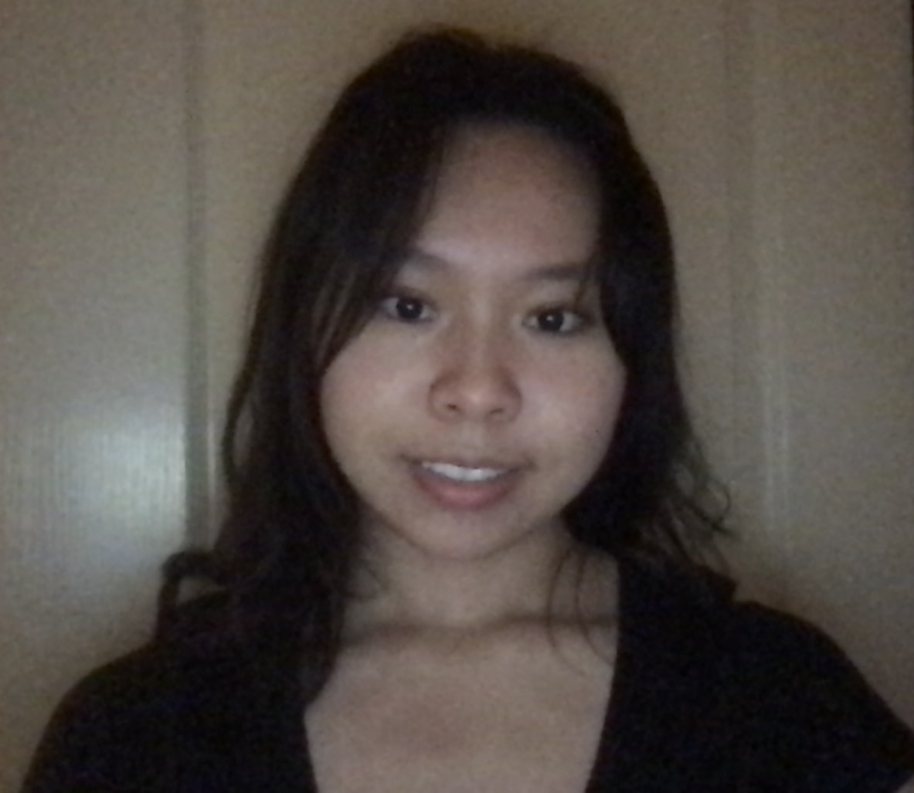

## Hi, I'm Samantha Lin
##### About Me
I'm a student at **UCSD** majoring in ***Mathematics-Computer Science*** and minoring in _Business_ and _Accounting_.

**My favorite programming language is  ~~C++~~ _Python_!**

###### Interesting Quote
In the words of an American artist, Georgia O'Keeffe:
>I’ve been absolutely terrified every moment of my life—and I’ve never let it keep me from doing a single thing I wanted to do.

###### Random Facts About Me
A Git command I always forget that comes before `git commit` is `git add`.

I love [Google](https://google.com) because this is where I learn everything and is where I go to when I'm stuck on programming.

One of my favorite places in the US is the ***Rocky Mountains*** because I got to see a moose [The Rocky Mountains with a moose in the water](./images/rockymtmoose.PNG). _I wish I could sit here all day and code._

###### Interests
Some programming languages I want to _learn_ are 
- Javascript 
- C# 
- PHP

My **favorite** programming languages in order are
1. Python
2. Java
3. C
4. C++

###### Goals
Some of my **goals** for 2021 are
- [x] Try a variety of brands of ice cream
- [x] Learn how to crochet
- [x] Learn a programming language
- [ ] Get a job/intership

To re-read about me [section link](file:///Users/samanthalin/samanthalin/index.md#about-me)